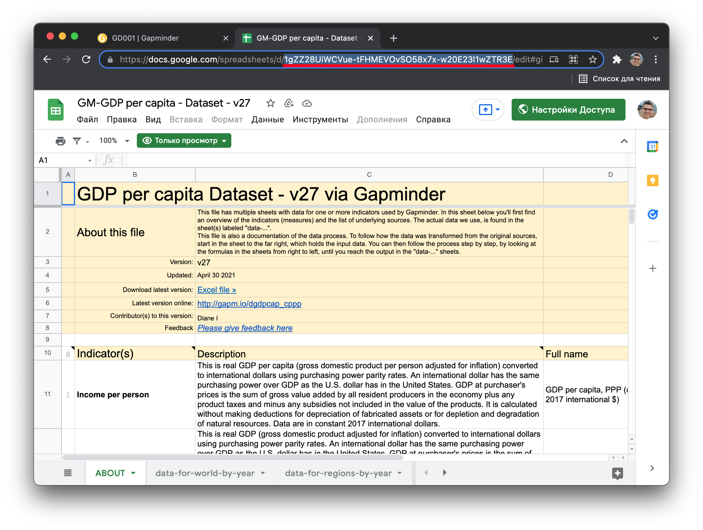

# Основы статистики {#stats}


## Предварительные требования {#stat_analysis_prerequisites}

Для работы по теме текущей лекции вам понадобятся пакеты из __tidyverse__. Помимо этого, мы будем работать с данными через интерфейс _Google Sheets_ напрямую с использованием пакетов [__googledrive__](https://googledrive.tidyverse.org/) и [__googlesheets4__](https://googlesheets4.tidyverse.org/). Также в лекции используется пакет __ggrepel__, позволяющий устранять конфликты подписей на графиках __ggplot__:

```r
library(tidyverse)
library(googledrive)
library(googlesheets4)
library(ggrepel)
library(readxl)
```

## Введение {#stat_analysis_intro}

__Математическая статистика__ --- раздел математики, посвящённый математическим методам систематизации, обработки и использования статистических данных для научных и практических выводов. Под статистическими данными обычно понимают числовую информацию, извлекаемую из результатов выборочных обследований, результаты серии неточных измерений и вообще любую систему количественных данных [@bigenc:matstat].

Статистический метод представляет собой важнейший инструмент исследования, применяющийся во всех без исключения областях науки и технологий. Математическая статистика тесно связана с теорией вероятностей -- разделом математики, изучающим математические модели случайных явлений. В силу огромного разнообразия статистических методов и специфики их применения в разных приложения, в одной лекции нет возможности (и смысла) представить их в одной лекции. 

В связи с этим в настоящем разделе представляются основные инструменты статистики, такие как: простейшие приемы статистического описания (описательные статистики), проверка статистических гипотез, оценка плотности распределения, корреляция и регрессия. Помимо этого, в настоящем разделе большое внимание уделено построению специализированных графиков, отражающих особенности распределения величины: гистограмм, диаграмм размаха, линий регрессии и локальной регрессии, кривых и поверхностей плотности распределения.

### Источники данных {#stat_analysis_intro_sources}

#### База данных Gapminder {#stat_analysis_intro_gapminder}

В данной лекции мы будем работать с базой данных [__Gapminder__](https://www.gapminder.org/), которая содержит уникальный набор показателей по странам мира, агрегированный из различных источников (многие показатели имеют ряды на несколько столетий!):


__Gapminder__ отлично подходит для знакомства со основами статистического  анализа в R, поскольку эта база данных содержит показатели с разным видом распределения, которые сгруппированы по макрорегионам и континентам, и, разумеется, имеют между собой ряд взаимосвязей, совместное поведение которых можно изучать посредством корреляционного и регрессионного анализа.

Данные __Gapminder__ можно загружать в текстовом формате и формате _Microsoft Excel_, но куда интереснее делать это непосредственно онлайн через программный интерфейс Google Sheets. Для этого нам потребуется знать ключ каждой таблицы, которую мы загружаем. Ключ можно определить, нажав "лупу" для просмотра данных и скопировав его из адресной строки (см. выделение):



#### Пакет googlesheets {#stat_analysis_intro_gapminder_google}

Доступ к облачным таблицам — удобный способ работы с табличными данными, который позволяет избавиться от манипуляций с локальными файлами. Свои данные вы тоже можете хранить в таблицах Google. Если таблицы регулярно обновляются держателем данных, загрузка их из облачного хранилища будет гарантировать вам актуальность анализируемой информации. Ограниченем такого режима работы является то, что для доступа к данным вам нужен Интернет.

Пакет [__googlesheets4__](https://googlesheets4.tidyverse.org/) разработан профессором статистики [Дженнифер Брайан](https://github.com/jennybc) для обеспечения онлайн-доступа к таблицам Google. С кратким руководством по использованию пакета вы можете ознакомиться [тут](https://googlesheets4.tidyverse.org/articles/articles/drive-and-sheets.html). Данный пакет использует версию _4.x Google Sheets API_ (отсюда цифра 4 в навании) и рекомендуется к использованию вместо устаревшего пакета [__googlesheets__](https://cran.r-project.org/web/packages/googlesheets/). 

Пакет __googlesheets4__ работает в связке с пакетом __googledrive__, обеспечивающим общие методы доступа к Google Drive. Стандартная последовательность действий чтобы получить в текущей сессии таблицу с _Google Drive_, выглядит так:

1. Подключить библиотеки __googledrive__ и __googlesheets4__.
2. Выполнить авторизацию пользователя путем вызова `drive_auth()`. При вызове этой функции откроется браузер на странице аутентификации Google. Вам необходимо будет войти в систему под своей учетной записью Google.
3. Загрузить таблицу с помощью функции `drive_get()`, передав ей в качестве аргумента название таблицы (в этом случае она будет искаться на _вашем_ диске Google) или идентификатор таблицы (этим способом можно выгрузить в среду R таблицу из любого открытого хранилища Google Drive). Если передается идентификатор таблицы, его необходимо обернуть в класс `drive_id` путем вызова функции `as_id()`.

Рассмотрим как это работает на примере загрузки данных из хранилища _Gapminder_.

## Одна переменная {#stat_analysis_one}

### Оценка распределения {#stat_analysis_one_distr}

Для оценки распределения случайной величины можно использовать графические и статистические способы. Выявление типа распределения важно, поскольку статистические методы не универсальны, и во многих случаях предполагают, что изучаемая переменная подчиняется определенному закону распределения (как правило, нормальному).

В качестве примера возьмем данные по ВВП на душу населения, они содержатся в таблице gapminder с ниже приведенным кодом


